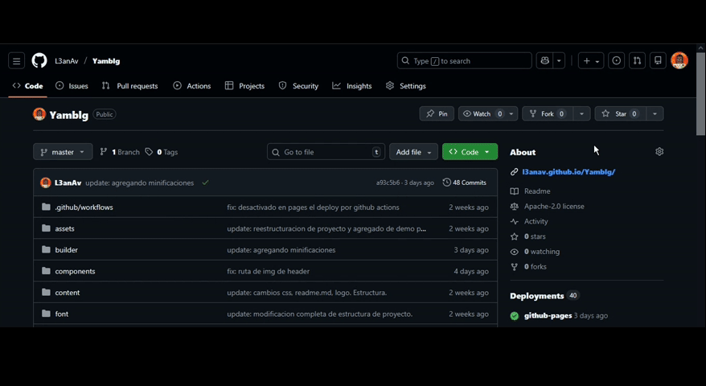

[comment]
Author !Leandro Avila leandroav.dev@gmail.com

:fecha: 20/01/2026

ifdef::env-github[]
++++

  

++++
endif::[]

Diseñado para quienes quieren un blog personal rápidamente, sin tanta configuración. La idea es: copias el repositorio, creas las publicaciones en YAML, y publicas en GitHub Pages.

[.text-center]
image:https://img.shields.io/badge/Status-Active-brightgreen?style=flat-square[Status]
image:https://img.shields.io/badge/go-v1.25+-00ADD8?style=flat-square&logo=go&logoColor=white[Go Version]
image:https://img.shields.io/badge/Config-YAML-red?style=flat-square&logo=yaml&logoColor=white[Config]
image:https://img.shields.io/badge/Version-0.0.30-blue?style=flat-square[Version]

== 🛠️ [.underline]#¿Cómo se usa?#

Tener tu blog es tan sencillo como seguir estos tres pasos:

* **Fork Master o copias el repositorio**

* **Configura:** Crea archivos del estilo `{name}.yaml` (el {name} se utiliza en tal caso de que title sea vacío). El archivo se crea siguiendo la siguiente estructura:

[source,text]
title: <Nombre de la entrada>
date: Completa automaticamente con la fecha de creación del archivo 
(todavía no implementado al 19/01/2026)
fijado: Se muestra en home resaltado
author: <Quien escribe la entrada>
description: <Resumen de contenido>
body: <Contenido de la entrada>

.Ejemplo del archivo "03-01-2025.yaml":
[source,yalm]
title: "Hola, Bienvenido a Yamblg!"
date: "03-01-2025"
fijado: false
author: "!Leandro Avila"
description: "Primer post creado para mostrar en la demo."
body: "Bienvenido a la demo de Yamblg. Gracias por su visita. 
Espero que te sea de utilidad el mini proyecto."

* **Publica:** pushea los cambios al repositorio, ¡Listo!.

[WARNING]
====
**¡OJO!** En los ajustes de tu repositorio, ve a PAGES y activa *GitHub Pages* con la opcion de **Github Actions**.
====

ifdef::env-github[]
++++

  
Muestra de donde esta la configuración

++++
endif::[]

=== Configurar config.yaml

[source,yalm]
baseUrl: "/Yamblg" -> Nombre del repositorio
siteTitle: "Yamblg | Crea tu blog rápidamente" -> Título del blog
useSectionPost: -> Usar sección últimos posts
    active: true -> true | false
    limitOfPost: 5 -> numero de posts
    method: "Latest" -> metodo de filtrado
usePinned: -> Mostar post fijados solamente
    active: true -> true | false

## ⚙️ Cómo funciona

xref:.docs/estructura.adoc[Detalle de estructura de proyecto]

Yamblg utiliza una arquitectura de SSG.

* **YAML para el contenido:** No hay bases de datos. Todo el contenido y la configuración viven en archivos de texto plano fáciles de leer.
* **Go como Procesador:** El binario de Go toma tus archivos YAML y los transforma en HTML puro usando las pages.
* **Automatización Total:** Gracias a GitHub Actions, cada vez que editas un archivo y subes el cambio la repositorio, el blog se reconstruye y se despliega solo.

Desarrollado para la simplicidad. Desarollado para la comunidad. 💖 &#13;

**¡Go publish!**

Última Actualización de documento:
{fecha}

